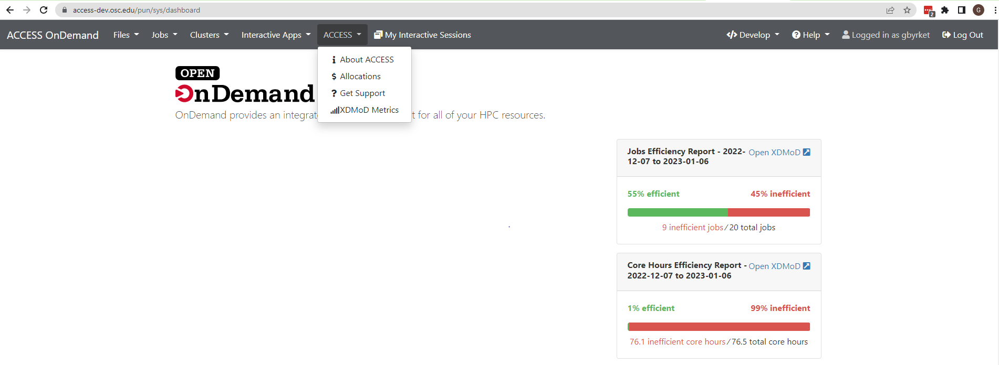

# Access OnDemand Menu


[](https://opensource.org/licenses/MIT)

This is a menu to display links back to sections of the main ACCESS web page.



## OnDemand 3.0 pure configuration

While this package is nice, in OnDemand 3.0 the functionality provided by this package can be
added to OnDemand purely through a configuration file in the `/etc/ood/config/ondemand.d/` directory.

```yaml
# /etc/ood/config/ondemand.d/nav_config.yml

nav_bar:

  # These are the default configurations that would appear without this configuration.
  # Since we're redefining the navigation bar, you have to add them back.
  - files
  - jobs
  - clusters
  - interactive apps
  - my interactive sessions
  - all apps

  # This configuration adds the ACCESS menu in the navigation bar.
  - title: 'ACCESS'
    links:
      - url: https://access-ci.org
        title: About ACCESS
        icon: fas://info
      - url: https://allocations.access-ci.org
        title: Allocations
        icon: fas://dollar-sign
      - url: https://support.access-ci.org
        title: Get Support
        icon: fas://question
      - url: https://metrics.access-ci.org
        title: XDMoD Metrics
        icon: fas://signal
```

## Install

### EL8
```sudo dnf install ondemand-bc_access_menu```

### EL7 or equivalent
```sudo yum install ondemand-bc_access_menu```

### Ubuntu
COMING SOON...

## Post Install
Now that you've installed the menu, you need to make it visible in the Navbar.

### OnDemand 2.0 or less

For sites running OnDemand version 2.0.x or less, you have to modify the `NavConfig.categories`
as described in [2.0 documentation on adding navigation categories](https://osc.github.io/ood-documentation/release-2.0/customization.html#control-which-apps-appear-in-the-dashboard-navbar)
for more information.

Add the category `ACCESS`

```ruby
  # /etc/ood/config/apps/dashboard/initializers/nav_config.rb
  NavConfig.categories << 'ACCESS'
```

### OnDemand 3.0 or greater

In OnDemand 3.0 and greater, the `ACCESS` menu will be shown by default when you've installed
the package.

Should you want to change what categories are shown in the navigation bar, use the
`nav_categories`configuration.

Add `ACCESS` to a configuration file in the `/etc/ood/config/ondemand.d/` directory.

```yaml
# /etc/ood/config/ondemand.d/nav_config.yml
nav_categories: ['Apps', 'Files', 'Jobs', 'Clusters', 'Interactive Apps', 'ACCESS']
```

See the [documentation on nav_categories](https://osc.github.io/ood-documentation/latest/reference/files/ondemand-d-ymls.html#nav-categories)
for more information.

## Limiting Access by group membership

You can limit the access to this menu bar by applying file access controls (FACLs).
You can apply FACLs to both the applications you've installed if you installed the package
and the configuration file if you're using pure configuration.

Simply use `chmod` and `chown` against the application directories or the configuration file,
whichever applies.

First apply 750 permissions with `chmod`.

```
chmod 750 /var/www/ood/apps/sys/bc_access_menu_about/
chmod 750 /var/www/ood/apps/sys/bc_access_menu_allocations/
chmod 750 /var/www/ood/apps/sys/bc_access_menu_metrics
chmod 750 /var/www/ood/apps/sys/bc_access_menu_support
```
or, if you're using configuration:
```
chmod 750 /etc/ood/config/ondemand.d/nav_config.yml
```

Now apply `chown` such that only members of the group `access` can view
the files. This will mean that only users in the `access` group will be
able to see this menu.  All other users will see the default menu.

Note that the group you're applying here may differ.

```
chown root:access /var/www/ood/apps/sys/bc_access_menu_about/
chown root:access /var/www/ood/apps/sys/bc_access_menu_allocations/
chown root:access /var/www/ood/apps/sys/bc_access_menu_metrics
chown root:access /var/www/ood/apps/sys/bc_access_menu_support
```
or, if you're using configuration:
```
chown root:access /etc/ood/config/ondemand.d/nav_config.yml
```


## License

* Documentation, website content, and logo is licensed under
  [CC-BY-4.0](https://creativecommons.org/licenses/by/4.0/)
* Code is licensed under MIT (see LICENSE.txt)


